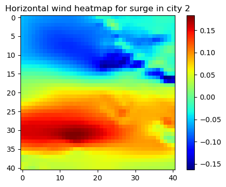

# Can you predict the tide ?

**Cours : Information et Complexité**  
_Hugo Ninou_  
April 2022

## Table of Contents

1. [Introduction](#introduction)  
2. [Analyse des données](#analyse-des-donnees)  
    1. [Cartes de chaleur](#cartes-de-chaleur)  
    2. [Autocorrélation du surplus de marée dans le temps](#autocorrelation-du-surplus-de-maree-dans-le-temps)  
3. [Développement d'un réseau de neurones récurrent (RNN)](#developpement-dun-reseau-de-neurones-recurrent-rnn)  
    1. [Le modèle Encoder-Decoder](#le-modele-encoder-decoder)  
    2. [Division du jeu de données en training-set et testing-set](#division-du-jeu-de-donnees-en-training-set-et-testing-set)  
    3. [Implémentation naïve sans utiliser les champs de pression](#implementation-naive-sans-utiliser-les-champs-de-pression)  
    4. [Implémentation naïve en utilisant l'ensemble des champs de pression et de vent](#implementation-naive-en-utilisant-lensemble-des-champs-de-pression-et-de-vent)  
    5. [Implémentation avec réduction de dimensionalité des champs de pression et de vent](#implementation-avec-reduction-de-dimensionalite-des-champs-de-pression-et-de-vent)  
4. [Conclusion](#conclusion)

## Introduction

Ce projet s'inscrit dans le cours Information et Complexité, et ambitionne de répondre au défi 'Can you predict the tide?'. Le défi consiste à prédire le surplus de marée à partir de mesures et champs de pression passés. L'objectif est de répondre de manière plus efficace aux événements de marées extrêmes. Dans ce rapport, nous détaillons notre démarche en deux temps : une analyse des données, suivie d'une implémentation d'un modèle _Encoder-Decoder_.

## Analyse des données

### Cartes de chaleur

Nous avons commencé par étudier le jeu de données en effectuant une régression linéaire du surplus de marée en fonction des champs de pression. Les résultats sont présentés sous forme de cartes de chaleur (Figure 1). Nous observons une corrélation notable entre le surplus de marée et le champ de pression.

Les dérivées spatiales du champ de pression, appelées vent horizontal et vent vertical, ont également été analysées, et les résultats sont visibles dans les figures \[2\] et \[3\]. Le vent horizontal semble contenir plus d'information pertinente.

#### Figure 1: Carte de chaleur de la corrélation entre le champ de pression centré réduit et le surplus de marée pour la ville 1 (gauche) et 2 (droite).

#### Figure 2: Carte de chaleur de la corrélation entre le vent horizontal centré réduit et le surplus de marée pour la ville 1 (gauche) et 2 (droite).

#### Figure 3: Carte de chaleur de la corrélation entre le vent vertical centré réduit et le surplus de marée pour la ville 1 (gauche) et 2 (droite).

### Autocorrélation du surplus de marée dans le temps

Nous avons ensuite analysé l'autocorrélation du surplus de marée dans le temps pour les deux villes. Les résultats, visibles dans la figure \[4\], montrent une corrélation plus forte pour la ville 2 que pour la ville 1.

#### Figure 4: Autocorrélation du surplus de marée pour la ville 1 (gauche) et 2 (droite).

## Développement d'un réseau de neurones récurrent (RNN)

L'utilisation de réseaux de neurones pour des prédictions météorologiques est relativement récente. Nous nous sommes basés sur l'architecture _Encoder-Decoder_ pour notre modèle.

### Le modèle Encoder-Decoder

L'architecture est présentée dans la figure \[5\]. Le réseau est composé de cellules récurrentes (GRU) qui prennent en entrée une série temporelle et transmettent un _hidden vector_. Ce vecteur est ensuite passé au _decoder_, qui prédit le surplus de marée au temps \(t+1\).

#### Figure 5: Architecture du modèle Encoder-Decoder implémenté.

### Division du jeu de données en training-set et testing-set

Nous avons divisé les données en _training set_ et _testing set_. Cependant, des disparités ont été observées dues à la proximité temporelle de certains points de données, nécessitant une révision de la segmentation.

### Implémentation naïve sans utiliser les champs de pression

Une première tentative a été faite en utilisant uniquement la série temporelle des surplus de marée. Les résultats sont visibles dans la figure \[6\].

#### Figure 6: Scores pour le training set et test set en fonction des epochs d'apprentissage sans utiliser les champs de pression.

### Implémentation naïve en utilisant l'ensemble des champs de pression et de vent

Nous avons ensuite ajouté les champs de pression et de vent au modèle. Les résultats montrent une légère amélioration, visible dans la figure \[7\].

#### Figure 7: Scores pour le training set et test set en fonction des epochs d'apprentissage en utilisant l'ensemble des champs de pression et de vent.

### Implémentation avec réduction de dimensionalité des champs de pression et de vent

Nous avons proposé une méthode plus efficace en réduisant les dimensions des champs de pression et de vent. Cela a permis d'améliorer les résultats tout en réduisant considérablement le nombre de paramètres. Les résultats sont visibles dans la figure \[8\].

#### Figure 8: Scores pour le training set et test set en fonction des epochs d'apprentissage avec réduction de dimensionalité des champs de pression et de vent.

## Conclusion

Nous avons proposé une approche _Encoder-Decoder_ pour prédire le surplus de marée en nous basant sur une analyse minutieuse des données. La réduction de la dimensionnalité des champs de pression a permis d'améliorer les résultats et d'éviter le surapprentissage. Une optimisation supplémentaire pourrait inclure les champs de pression antérieurs pour une meilleure prédiction.

---

### References

- Scher, S., & Messori, G. (2019). Weather prediction using deep learning.
- Phandoidaen, P. et al. (2020). Forecasting with recurrent neural networks.
- Pascanu, R., Mikolov, T., & Bengio, Y. (2013). Difficulty of training RNNs.
- Kingma, D.P., & Ba, J. (2017). Adam: A method for stochastic optimization.
