> 1 Introduction

$$

a=b

$$

Ce projet s'inscrit dans le cours Information et Complexit´e, et
ambitionne de r´epondre au d´efi 'Can you predict the tide?'. Le d´efi
propos´e par l'´equipe FLUMINANCE de l'Inria consiste a\` pr´edire le
surplus de mar´ee \`a partir de mesures et champs de pression pass´es.
L'application tr\`es directe de ce d´efi est de pouvoir r´epondre de
mani\`ere plus eficace aux ´ev´enements de mar´ees extr\`emes. Dans ce
rapport, nous d´etaillons notre d´emarche qui se fait en deux temps.
Nous rapportons premi\`erement les ´el´ements essentiels de l'analyse
du jeu de donn´ees que nous avons a\` notre disposition. Cette analyse
nous permet dans un second temps de proposer une impl´ementation
pertinente d'un mod\`ele 'Encoder-Decoder' pour r´epondre au d´efi.

2 Analyse des donn´ees

2.1 Cartes de chaleur

Afin de proposer les algorithmes les plus pertinents pour r´esoudre le
probl\`eme propos´e, nous avons commenc´e par ´etudier le jeu de
donn´ees. Une premi\`ere approche consiste a\` faire une r´egression
lin´eaire du surplus de mar´ee \`a un temps donn´e \`a partir de
chaque point du champ de pression au mˆeme moment. Pr´ealablement, les
valeurs du champ de pression ont ´et´e centr´ees et r´eduites. La
corr´elation entre le surplus de mar´ee et le champ de pression en un
point nous donne alors la carte de chaleur de la figure 1. A noter que
l'on compte 5 fois plus de champs de pression que de points de surplus
de mar´ee. La r´egression lin´eaire est donc faite en prenant le champ
de pression le plus proche dans le temps du surplus de mar´ee. les
zones bleues correspondent aux points pour lesquels une d´epression
induit un surplus de mar´ee positif et inversement pour les zones
rouges. Avec cette analyse tr\`es simple, nous pouvons d´eja` dire
que la ville 1 semble se trouver dans le cadran Sud-Est de la carte
tandis que la ville 2 semble se trouver dans le cadran Nord-Ouest.

Nous pouvons proc´eder de la mˆeme mani`ere avec cette fois les
d´eriv´ees spa-tiales du champ de pression que nous appelons dans la
suite vent horizontal (d´eriv´ee selon l'axe des abscisse) et vent
vertical (d´eriv´ee selon l'axe des or-donn´ees). Les r´esultats sont
pr´esent´es dans les figures 2 et 3. On observe glob-alement que le
vent horizontal semble contenir plus d'information que le vent
vertical quant au surplus de mar´ee (les cartes de chaleur pour le
vent vertical contiennent beaucoup de coeficients proches de z´ero).

2.2 Autocorr´elation du surplus de marée dans le temps

Nous venons de voir brièvement l'information que les champs de
pression pou-vaient prodiguer sur le surplus de mar´ee dans les villes
1 et 2. Dans cette sous partie, nous nous attachons `a analyser
l'information que la s´erie temporelle

2

 et 2 (droite).")

{width="2.33917104111986in"
height="1.9457655293088365in"}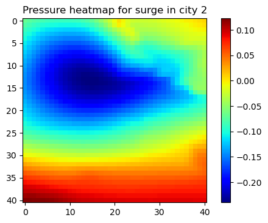{width="2.33917104111986in"
height="1.9457655293088365in"}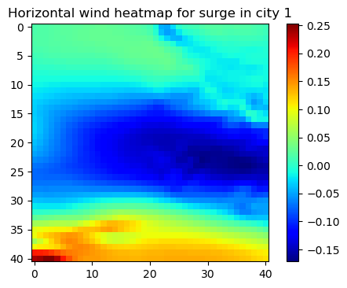{width="2.3392399387576552in"
height="1.937017716535433in"}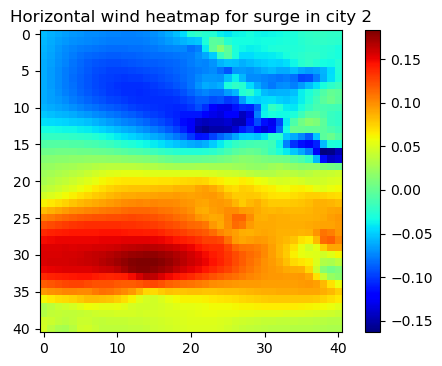{width="2.3392399387576552in"
height="1.937017716535433in"}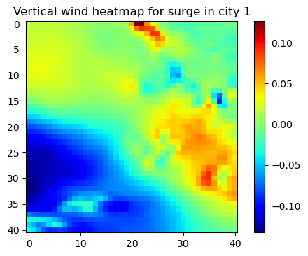{width="2.33917104111986in"
height="1.9457655293088365in"}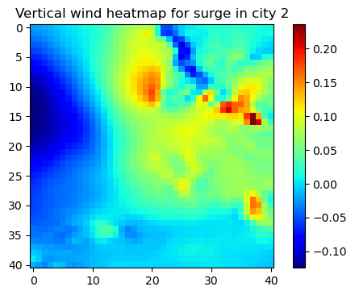{width="2.33917104111986in"
height="1.9457655293088365in"}

> Figure 1: Carte de chaleur de la corr´elation entre le champ de
> pression centr´e r´eduit et le surplus de mar´ee pour la ville 1
> (gauche) et 2 (droite).
>
> Figure 2: Carte de chaleur de la corr´elation entre le vent horizontal
> centr´e r´eduit et le surplus de mar´ee pour la ville 1 (gauche) et 2
> (droite).
>
> Figure 3: Carte de chaleur de la corr´elation entre le vent vertical
> centr´e r´eduit et le surplus de mar´ee pour la ville 1 (gauche) et 2
> (droite).
>
> 3

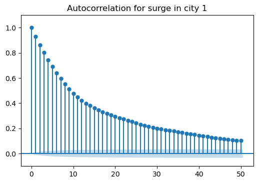{width="2.3391305774278215in"
height="1.6591502624671917in"}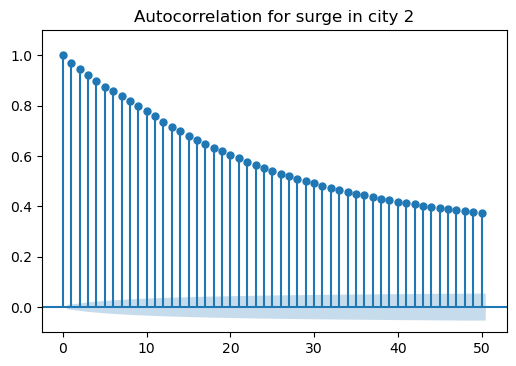{width="2.3391305774278215in"
height="1.6591502624671917in"}

> Figure 4: Autocorr´elation du surplus de mar´ee pour la ville 1
> (gauche) et 2 (droite).
>
> du surplus de mar´ee porte sur elle-mˆeme. Une fa¸con de proc´eder est
> de re-garder l'autocorr´elation du surplus de mar´ee dans le temps
> pour les villes 1 et 2. Apr`es avoir r´eordonn´e les donn´ees de
> surplus de mar´ee de fa¸con croissante dans le temps, nous avons
> trac´e les courbes d'autocorr´elation visibles dans la figure 4. Une
> des limites de cette approche est que le temps ´ecoul´e entre deux
> points cons´ecutifs n'est pas r´egulier. Il est d'en moyenne 9 heures
> mais environ deux tiers des points sont ´evalu´es exactement au mˆeme
> moment que le point pr´ec´edent. Ceci r´esulte sans doute d'une
> augmentation au pr´ealable du jeu de donn´ees. N´eanmoins, il est tout
> de mˆeme possible de constater que le surplus de mar´ee est assez
> autocorr´el´e dans le temps, et de fac¸on bien plus marqu´ee pour la
> ville 2 que pour la ville 1. Il sera donc a priori beaucoup plus
> simple d'inf´erer un bon r´esultat pour la ville 2 que pour la ville 1
> et c'est en effet ce que l'on observe en s´eparant le score pour
> chacune des deux villes.
>
> 3 D´eveloppement d'un r´eseau de neurones r´ecurrent (RNN)
>
> Led´eveloppementder´eseauxdeneuronesartificielsafinder´esoudredesprobl\`emes
> de pr´edictions en m´et´eorologie et climatologie est assez r´ecent.
> Ici nous nous inspirons de deux articles qui font appel \`a une
> architecture de type "Encoder-Decoder" \[1]\[2]\[3] qui propose des
> performances de pointe pour la pr´ediction de s´eries temporelles.
>
> 3.1 Le mod`ele Encoder-Decoder
>
> L'architecture du mod\`ele Encoder-Decoder que nous impl´ementons dans
> la suite est pr´esent´ee figure 5. Elle consiste en une succession de
> cellules r´ecurrentes (GRU cells) qui prennent en entr´ee un vecteur
> issu d'une s´erie temporelle et se transmettent un 'hidden vector'
> encodant l'´etat du syst\`eme. Une fois toute la s´equence d'entr´ee
> donn´ee a\` l'encoder, le 'hidden vector' final est transmis a\`
>
> 4
>
> **Encoder** **Decoder** **Decoder** **cell**

**GRU** **cell** **...**

> **...**

GRU cell

> **linear**

**Decoder** **cell**

**...**

> **...**
>
> Figure 5: Architecture du mod`ele Encoder-Decoder impl´ement´e
>
> un decoder fait de cellules r´ecurrentes (decoder cells) qui prennent
> en entr´ee le surplus de mar´ee au temps t et donnent en sortie le
> surplus de mar´ee au temps t+1. L'impl´ementation est faite en Python
> `a l'aide de la librairie Pytorch.
>
> Concernant les cellules r´ecurrentes, plusieurs choix peuvent ˆetre
> faits. La cellule de base consiste en une simple multiplication
> matricielle suivie d'une application d'une fonction non-lin´eaire.
> Cette approche pose des probl\`emes en mati\`ere d'apprentissage
> (explosion ou extinction de gradient \[4]). Pour pallier a\` cela,
> des cellules LSTMs ont ´et´e d´evelop´ees. Les cellules GRU sont une
> alter-native et pr´esentent l'avantage d'avoir moins de param\`etres
> tout en proposant des performances identiques.
>
> La descente de gradient est r´ealis´ee graˆce a` la m´ethode Adam
> \[5] avec une r´egularisation L2.
>
> 3.2 Division du jeu de donn´ees en training-set et testing-set
>
> Nous avons commenc´e par segmenter le jeu de donn´ees en un training
> set (90%) et un testing set (10%) de fa¸con al´eatoire. Seulement de
> grosses disparit´es ´etaient observ´ees entre le score sur le testing
> set que nous avons cr´e´e et celui du challenge. Ceci ´etait duˆ au
> fait que le jeu de donn´ees pr´esente plusieurs points en r´ealit´e
> tr\`es proches, voire parfois se superposant dans le temps ce qui
> amenait le surapprentissage du training set a\` se reporter sur le
> testing set. Pour y rem´edier, nous segmentons le jeu de donn´ees par
> blocs de points de temps qui se suivent et qui sont donc corr´el´es
> dans le temps (se r´ef´erer a` la figure 4).
>
> 3.3 Impl´ementation na¨ıve sans utiliser les champs de pres-sion
>
> Une premi\`ere tentative consiste a\` utiliser le r´eseau de neurones
> tel que pr´esent´e a` la figure 5 en ne prenant en entr´ee que la
> s´erie temporelle des surplus de mar´ee et
>
> 5

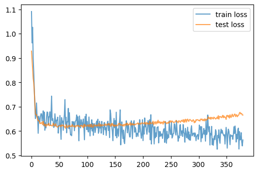{width="2.8643153980752407in"
height="1.9150940507436571in"}

> Figure 6: Scores pour le training set et test set en fonction des
> epochs d'apprentissage dans le cas d'une impl´ementation na¨ıve sans
> utiliser les champs de pression. Le minimum est atteint en 0.63.
>
> **Encoder** **Decoder** **Decoder** **cell**

**GRU** **cell** **...**

> **...**

GRU cell

> **linear**

**Decoder** **cell**

**...**

> **...**
>
> Figure 7
>
> en ignorant les champs de pression et de vent. De sorte \`a minimiser
> le score, nous avons optimis´e \`a tˆatons les param\`etres du r´eseau
> comme le nombre de couches au sein de chaque cellule, la taille du
> 'hidden vector', ou encore le dropout consistant \`a ignorer
> al´eatoirement un certain pourcentage de param\`etres lors de
> l'apprentissage. Nous avons trouv´e qu'avec deux couches, un vecteur
> cach´e de taille 25 et un taux de dropout de 20%, nous arrivions a\`
> un score minimal de 0.63. L'´evolution du test score au cours de
> l'apprentissage est visible figure 6.
>
> 3.4 Impl´ementation na¨ıve en utilisant l'ensemble des champs de
> pression et de vent
>
> Une seconde approche consiste cette fois `a constituer un grand
> vecteur du sur-plus de mar´ee dans chaque ville accompagn´e des champs
> de pression et de vent
>
> 6

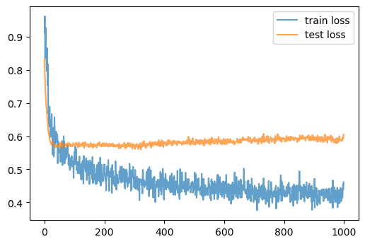{width="2.8643153980752407in"
height="1.9150940507436571in"}

> Figure 8: Scores pour le training set et test set en fonction des
> epochs d'apprentissage dans le cas d'une impl´ementation na¨ıve en
> utilisant l'ensemble des champs de pression et de vent. Le minimum est
> atteint en 0.57.
>
> au moment le plus proche (voir figure 7), r´esultant en un vecteur en
> entr´ee de taille 5045. Les r´esultats obtenus dans ce cas de figure
> sont pr´esent´es dans la figure 8 pour 4 couches, un 'hidden vector'
> de taille 200 et un taux de dropout de 50%. Ce r´eseau atteint un
> score minimal de 0.58, soit une am´elioration de 5% par rapport au
> pr´ec´edent, mais cela se fait au prix d'une multiplication par 25000
> du nombre de param\`etres. Une des grandes limitations de cette
> impl´ementation est la tendance au surapprentissage du mod\`ele,
> malgr´e la r´egularisation L2, qui nous pousse a\` utiliser un taux de
> dropout tr\`es ´elev´e.
>
> 3.5 Impl´ementation avec r´eduction de dimensionalit´e des champs de
> pression et de vent
>
> Enfin, nous proposons une impl´ementation moins na¨ıve de ce r´eseau
> de neurones et qui mette \`a profit l'analyse de donn´ees que nous
> avons faite. Plutoˆt que de donner en entr´ee l'ensemble des champs de
> pression et de vent, nous op´erons un produit scalaire entre ces
> champs et leurs cartes de chaleur associ´ees. Un champ de taille 41×41
> = 1681 devient alors un vecteur de taille 2 (une dimension par ville).
> La taille du vecteur d'entr´ee est donc de 8 plutoˆt que 5045, la
> dimensions des champs de pression et de vent a ´et´e grandement
> r´eduite. Tellement r´eduite qu'ajouter un dropout n'am´eliore pas la
> performance du r´eseau. Avec 4 couches pour les cellules r´ecurrentes
> et un 'hidden vector' de taille 25, nous obtenons un score de 0.5
> (figure 9 \`a droite) soit une am´elioration de 8% par rapport \`a la
> m´ethode na¨ıve incluant les champs de pression et de vent a\` l'´etat
> brut. La m´ethode propos´ee ici est plus performante et plus ´econome
> en termes de ressources puisqu'elle n´ecessite 5000 fois moins de
> param`etres.
>
> Remarquons que nous n'utilisons qu'un cinqui\`eme des champs de
> pression \`a notre disposition. Une extension a` envisager serait de
> ne pas consid´erer seule-ment le champ de pression le plus rapproch´e
> dans le temps de la mesure du surplus de mar´ee, mais d'inclure les 4
> champs ant´erieurs ce qui pourrait ap-
>
> 7

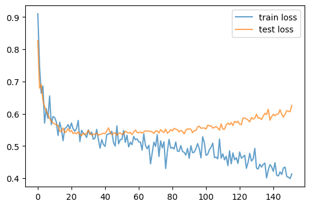{width="2.8643153980752407in"
height="1.9150940507436571in"}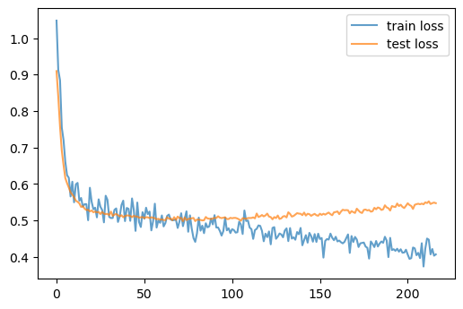{width="2.8643153980752407in"
height="1.9150940507436571in"}

> Figure 9: Scores pour le training set et test set en fonction des
> epochs d'apprentissage. A gauche en rajoutant au surplus de mar´ee en
> entr´ee seulement un scalaire d'information sur le champ de pression
> pour chaque ville(minimum atteint en 0.55). A droite en rajoutant de
> surcroˆıt deux scalaires pour chaque ville, un pour le vent horizontal
> et l'autre pour le vent vertical (minimum atteint en 0.5).
>
> porter de l'information suppl´ementaire. Il faudrait alors recalculer
> des cartes de chaleur donnant la corr´elation entre le surplus de
> mar´ee au temps t et ces champs aux temps t−1, t−2, t−3 et t−4.
>
> 4 Conclusion
>
> A la lumi\`ere d'une´etape d'analyse des don´ees minutieuse, nous
> avons propos´e un mod\`ele Encoder-Decoder pour r´epondre au d´efi
> lanc´e. Dans le cadre du mod\`ele Encoder-Decoder, la question de la
> compression de l'information contenue dans le champ de pression est
> centrale. En effet, donner en entr´ee au r´eseau les champs pression
> tels quels entrainent des probl\`emes de surapprentissage dificiles
> a\` r´esoudre et la m´ethode que nous proposons consistant \`a
> r´eduire des champs entiers en simplement un scalaire est sans doute
> extr\`eme mais permet une bonne explicabilit´e du mod\`ele et fourni
> de tr\`es bons r´esultats. L'approche optimale se situe sans doute \`a
> mi-chemin entre ces deux extr\`emes, le choix de m´ethodes de
> compression invariantes par translation ´etant \`a proscrire car la
> localisation des d´epressions et du vent est ici porteuse d'une
> information pr´ecieuse \`a la r´esolution du probl\`eme.
>
> 8
>
> References
>
> \[1] Sebastian Scher and Gabriele Messori. Weather and climate
> forecasting with neural networks: using general circulation models
> (GCMs) with dif-ferent complexity as a study ground. Geoscientific
> Model Development, 12(7):2797--2809, July 2019.
>
> \[2] Nathawut Phandoidaen and Stefan Richter. Forecasting time series
> with encoder-decoder neural networks. arXiv:2009.08848 \[math, stat],
> September 2020. arXiv: 2009.08848.
>
> \[3] Encoder-Decoder Model for Multistep Time Series Forecasting
> Using Py-Torch | by Gautham Kumaran | Towards Data Science.
>
> \[4] Razvan Pascanu, Tomas Mikolov, and Yoshua Bengio. On the
> dificulty of training Recurrent Neural Networks. arXiv:1211.5063
> \[cs], February 2013. arXiv: 1211.5063.
>
> \[5] Diederik P. Kingma and Jimmy Ba. Adam: A Method for Stochastic
> Opti-mization. arXiv:1412.6980 \[cs], January 2017. arXiv: 1412.6980.
>
> 9