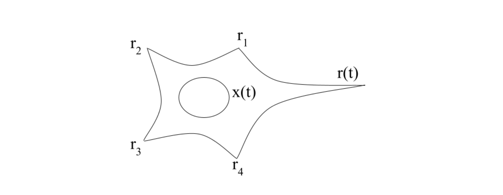
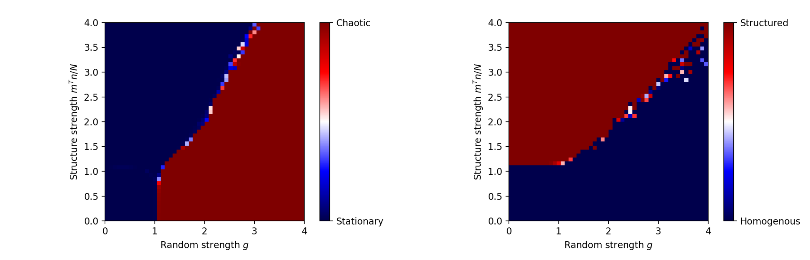
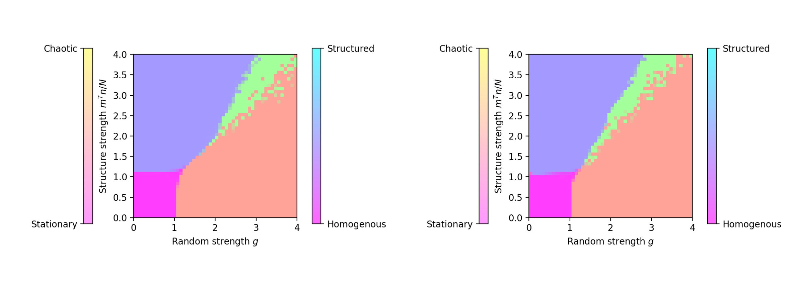
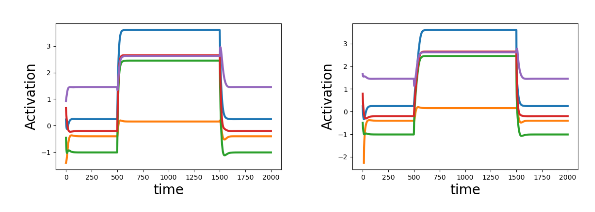
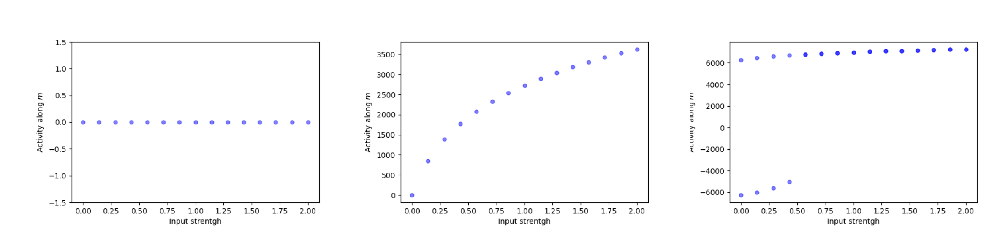
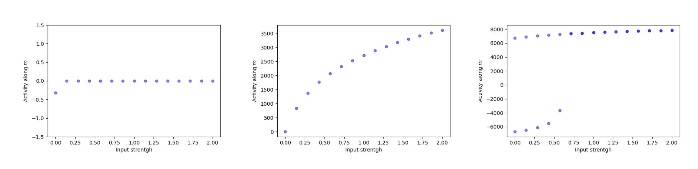

## Table of Contents
1. [Introduction](#introduction)
2. [Theoretical Framework](#theoretical-framework)
    1. [Building a firing rate model](#building-a-firing-rate-model)
        1. [The firing rate](#the-firing-rate)
        2. [The total synaptic current](#the-total-synaptic-current)
    2. [Networks with low-rank connectivity matrices](#networks-with-low-rank-connectivity-matrices)
        1. [Networks with unit-rank structure](#networks-with-unit-rank-structure)
        2. [Dynamical Mean-Field Theory](#dynamical-mean-field-theory)
        3. [Dynamical Mean-Field Theory extension to the $\tau_r \gg \tau_s$ case](#dynamical-mean-field-theory-extension-to-the-\(\tau_r-\gg-\tau_s\)-case)
3. [Spontaneous Activity](#spontaneous-activity)
    1. [Reproduction of the paper's phase diagram](#reproduction-of-the-papers-phase-diagram)
    2. [Comparison with the phase diagram in the $\tau_r \gg \tau_s$ case](#comparison-with-the-phase-diagram-in-the-\(\tau_r-\gg-\tau_s\)-case)
4. [Response to an external input](#response-to-an-external-input)
    1. [Reproduction of figure 2.D of the article](#reproduction-of-figure-2D-of-the-article)
5. [Conclusion](#conclusion)

## Introduction

Cortical networks, which consist in highly interconnected neurons with recurrent synapses are believed to make for the fundamental units of mammalian brains. Observations show that cortical connectivity lies somewhere between fully structured and fully random. Several functional approaches have been made for connectivity design of cortical networks since the 80's but they lack a unifying conceptual picture. To address this matter, authors point out that all these approaches share something in common: the fact that the resulting connectivity matrices are low rank. This article [1] aims at linking the recurrent neural networks' dynamics to their connectivity matrix and showing how one can design the low-rank connectivity structure of such networks to implement specific computations. The latter point is illustrated on four specific tasks.

## Theoretical Framework

The model used here to describe cortical neural networks is a firing rate model. This means that each node (i.e. neuron) in the network is represented by its firing rate $\phi(x_i)$ with $\phi(x)=\textrm{tanh}(x)$ being the current-to-rate transfer function, and $i\in [1\dots N]$, with $N$ the number of neurons. The evolution of a neuron's firing rate is governed by equation (1).

$$
    \dot{x_i}(t) = -x_i(t) + \sum_{j=1}^N J_{ij} \phi(x_j(t)) + I_i \quad (1)
$$ 

where $J_{ij}$ is the connectivity matrix representing the synaptic connections of the network and $x_i$ is the external current input to neuron $i$. Note here that $\phi(x_i)$ representing the firing rate can have negative values. This can be dealt with by replacing the $\textrm{tanh}$ function, which makes the calculations easier, by a sigmoid without causing major changes to the theoretical results.

As all the results of this article come from analysis and simulations of this model, it is crucial to understand its limitations as for the description of cortical neural networks. With this goal in mind, we explore some developments in order to understand the underlying hypotheses and limitations of this model by building it again from scratch [2].

### Building a firing rate model

The behaviour of a neuron can be described by the neuronal response function $y(t)$ that encodes the exact time at which it fires spikes. A model involving $y(t)$ is called a spiking model. 
$$
        y(t) = \sum_{i=1}^n \delta(t-t_i),    \quad  r(t) = \int_t^{t+\Delta t}  \underbrace{\frac{1}{\Delta t}\langle y(\tau) \rangle  d\tau}_{\textrm{average over the trials}} \quad (2)
$$ 

Firing rate models focus on the quantity $r(t)$ in eq. (2) which is an approximation of the exact spike sequence $y(t)$. They have the advantage of being easier to simulate on computers as they do not take into account the short time scale dynamics of the spikes. As we want to model the total input for the neurons, we can look at $r(t)$ instead of $y(t)$ if there is not too much variability between two trials. Indeed, upon summing over different synapses, one has low variability (Central Limit Theorem) if the entries are numerous and uncorrelated.

Firing rate models are relevant when

1. The firing of neurons in a network is uncorrelated (there is little synchronous firing)
2. The precise patterns of spike timing are unimportant. Indeed, the information regarding those precise patterns is lost when averaging over the trials.

#### Figure 1: Sketch of a modeled neuron with presynaptic inputs $r_i$ and postsynaptic output $r(t)$. $x(t)$ is the total synaptic current or input.

In order to fully describe a firing rate model, we have to specify the dependence of the postsynaptic firing rate on the total synaptic input $r(x)$ and the dependence of the total synaptic input on the presynaptic inputs $x(r_1,r_2,r_3,r_4)$.

#### The firing rate

Let's first describe the firing rate $r(t)$ as a function of the total synaptic current $x(t)$. We could simply write $r(t) = \phi(x(t))$, $\phi$ being the current-to-rate function, but due to the membrane capacitance and resistance, we should rather express the firing rate $r(t)$ as a low-pass filtered version of its steady state with characteristic time $\tau_r$, usually of the order of 20 ms.

$$
    \tau_r \frac{dr}{dt} = -r + \phi(x(t))
$$ 

Note that in reality, it is the membrane potential, not the firing rate, that is a low pass of the input current and that the dynamics of the two are not the same. 

#### The total synaptic current

We now want to write the total synaptic current of neuron $i$, $x_i(t)$ as a function of the $N$ presynaptic firing rates $r_j(t)$ for $j \in [1 \dots N]$ and their associated weights $J_{ij}$. Note that $J_{ij}>0$ corresponds to an excitatory synapse while $J_{ij}<0$ corresponds to an inhibitory one. We introduce the synaptic kernel response function $K(t)$ that is simply the response current induced at time $t$ by a spike at time $t=0$. Assuming that the effects of a spike sum linearly, we can then write the total synaptic current as 

$$
    x_i(t) = \sum_{j=1}^{N} J_{ij} \int_{-\infty}^{t} d\tau K(t-\tau) \underbrace{y_j(\tau)}_{\sum_{k=1}^{N} \delta(\tau-t_k)}
$$ 

which in the firing rate model approximation writes

$$
    x_i(t) = \sum_{j=1}^{N} J_{ij} \int_{-\infty}^{t} d\tau K(t-\tau) r_j(\tau) \quad (3)
$$ 

By taking $K(t) = \exp(-t/\tau_s)/\tau_s$ (with $\tau_s$ the time constant that describes the decay of the synaptic conductance, usually of the order of a few milliseconds), then (3) can be written as a differential equation

$$
    \tau_s \frac{dx_i(t)}{dt} = -x_i(t) + \Big( \sum_{j=1}^{N} J_{ij} r_j(t) + I_i\Big) \quad (4)
$$ 

This is actually equation (1) of the paper in which $\tau_s$ was chosen equal to 1 for simplicity. Equations (4) and (2) give us the two parts needed to describe a firing rate model which can be simplified in two extreme cases:

- $\tau_r \gg \tau_s$: Then $x_i(t) = \sum_{j=1}^{N} J_{ij} r_j(t) + I_i$ and $r$ is a low-pass of $x(t)$.
- $\tau_r \ll \tau_s$: Then $r(t) = \phi(x(t))$, $r(t)$ follows $x(t)$ instantaneously.

Authors implicitly consider that we're in the situation where $\tau_r \ll \tau_s$ which is not obvious at all as both characteristic times seem to be of the same order of magnitude. This observation led me to explore what would have been the paper's results if they had instead considered the situation where $\tau_r \gg \tau_s$. This latter case yields the following equation for the system that has to be compared to equation (1):

$$
    \dot{r_i} = -r_i + \phi(\sum_{j=1}^N J_{ij}r_j+I_i) \quad (5)
$$ 

In the following, we will reproduce some of both theoretical and simulatory results of the paper and try to extend them to a system governed by equation (5).

### Networks with low-rank connectivity matrices

We start by placing ourselves in the same context as in the article i.e. with a negligible membrane relaxation characteristic time.

The connectivity matrix $J_{ij}$ is the sum of an uncontrolled random matrix $\chi$ and of a structured low ranked known matrix $P$. $J_{ij}$ is thus defined by

$$
    J_{ij} = \underbrace{g \chi_{ij}}_{\textrm{mean $0$, variance $g^2/N$}} + \underbrace{P_{ij}}_{\textrm{of order $1/N$}}
$$ 

Note that there is no biological reason for which $\chi_{ij}$ should have a variance scaling as $1/N$. This constraint makes possible the comparison of networks of different sizes from a theoretical perspective (especially in the case $N \to \infty$) and can be dealt with by adjusting the random strength $g$ at will.

#### Networks with unit-rank structure

We start with $P_{ij} = \frac{m_i n_j}{N}$ with $m=\{m_i\}$ and $n=\{n_j\}$ two N-dimensional vectors. Authors define two important parameters, $g$ the random strength, and $m^Tn/N$ the structure strength, that govern the type of dynamics of the system. The type of networks studied here is related to the Hopfield networks studied in class. However the unit-rank terms here do not require to be symmetric and can be correlated to each other. Regarding the biological plausibility of this proposed connectivity, it can be noticed that Dale's law is not imposed here. 

#### Dynamical Mean-Field Theory

Under the assumption of a large network with a weak low-dimensional connectivity matrix (scaling as $1/N$) one can derive the activity of each neuron thanks to dynamical mean-field theory by considering the mean and variance of the input it receives. Authors find that the average equilibrium input to unit $i$ is denoted $\mu_i = \kappa m_i$ with $\kappa = \langle n_i[\phi_i] \rangle_i$, that is that the activity of the network is one dimensional, along the vector $m$ as long as $\kappa>0$. As $\kappa$ represents the activity projected on vector $n$, non-vanishing values of $\kappa$ require a non-vanishing overlap between $m$ and $n$.

#### Dynamical Mean-Field Theory extension to the $\tau_r \gg \tau_s$ case

Starting from equation (5), we derive a Dynamical Mean-Field approach in order to express both $\mu_i \equiv [x_i]$ and $\Delta_0^I \equiv [x_i^2] - [x_i]^2$. Similarly to the derivation proposed in the supplementary information of the paper, one can consider the case where $I_i=0$ \forall i. By denoting

$$
    \eta_i(t) = \sum_{j=1}^N J_{ij} r_j = g \sum_{j=1}^N \chi_{ij} r_j + \frac{m_i}{N} \sum_{j=1}^N n_j r_j
$$ 

equation (5) can be rewritten as

$$
    \dot{r_i} = -r_i + \phi(\eta_i)
$$ 

In the stationary scenario, we would then have

$$
    r_i = \phi(\eta_i)
$$ 

By applying $\phi^{-1}$ to both sides of this equation, we fall back on equation 28 of the paper that gives us an expression for $\mu_i$ and $\Delta_0^I$.

$$
    \mu_i = [x_i] = m_i \kappa
$$ 

$$
    \Delta^I_0 = [x_i^2] - [x_i]^2 = g^2 \langle [\phi_i^2] \rangle
$$ 

Conducting a DMF analysis in the chaotic scenario is however trickier, and we do not develop it in this project although it is an interesting lead. 

## Spontaneous Activity

### Reproduction of the paper's phase diagram

#### Figure 2: Phase diagram obtained from personal simulations (50×50 resolution). Left: measures the chaotic nature of the system. Right: measures the structured nature of the system.

#### Figure 3: Left: Theoretical phase diagram from the article. Right: Phase diagram obtained from personal simulations (50×50 resolution).

In figure 1 of the article, a phase diagram is proposed. The result presented shows the phase diagram obtained from theoretical results. We chose to reproduce this phase diagram thanks to simulations (fig.3). To do so, finding the good statistics to describe the chaoticity and structuration of the system is crucial. Authors hint us in using the temporal variance of $x_i$, averaged over the number of neurons, to characterize chaoticity $\langle \textrm{std}_t(x_i) \rangle_i$. We use the activity along $m$, given by $\kappa = \langle n_i[\phi_i] \rangle_i$ to characterize structure. We superimposed the phase diagrams for chaoticity and structure shown in figure 2 to obtain the one shown on the right panel of figure 3.

Each of the 2500 pixels on the simulated phase diagram represents a simulation. The statistics were measured after a transient phase was over for 100 seconds with parameter $\Delta t = 0.5 \textrm{s}$. Considering the ergodicity theorem, this allows us not to have to make several simulations for each pair of parameters, which would have multiplied by the same amount the time spent in simulating the transient phase.

The biologically plausible phase is the one where there is both structured and chaotic activity.

### Comparison with the phase diagram in the $\tau_r \gg \tau_s$ case

We investigate the changes that using equation (5) instead of (1) would bring to the phase diagram describing the system's behavior. Interestingly, the phase diagram obtained for equation (5) is very similar to that of (1) (see figure 4). This was expected for the stationary part of the diagram but not necessarily for the chaotic part. This result hints us into thinking that the DMF theoretical results one would derive for our alternative model might be the same as the ones found in the paper.

#### Figure 4: Left: Phase diagram for $\tau_r \ll \tau_s$. Right: Phase diagram for $\tau_r \gg \tau_s$ (resolution 50 × 50).

## Response to an external input

For further analysis, we aim at comparing the behavior of our alternative model to that of the paper in response to an external stimulus $I$. As in the article, we look at the response of the system along the $m$ vector. Figure 5 shows the transient dynamics for both models when the system is subject to an external input with the same connectivity matrix and the same initial conditions. One can see that, as expected by the theory, the stationary states are the same while the transient phases slightly differ. Indeed, the system seems to evolve more slowly for the alternative model (figure 5 right).

#### Figure 5: Transient dynamics in the $\tau_r \ll \tau_s$ (Left) and $\tau_r \gg \tau_s$ (Right) scenarios in response to a step input.

### Reproduction of figure 2.D of the article

Figure 6, corresponding to figure 2.D of the article, plays a major role in the four task implementations designed in the following of the paper. Reproducing this result for our alternative model basically ensures that it will be able to perform the proposed tasks as well. The reproduction of this result is presented in figure 7. The activity along vector $m$ is recorded for 15 different intensities of the input in three case scenarios. First, in the case where $m$, $n$, and $I$ are all orthogonal in respect to each other. The system hence shows no response along $m$ as $\kappa = \langle n_i[\phi_i] \rangle_i = 0$ (fig.7 left). Second, in the case where $m$ and $n$ are orthogonal and $I$ has a component along $n$. The network then shows some activity along $m$ (fig.7 center). Finally, in the case where $m$ and $n$ have an overlap and $I$ is colinear to the orthogonal part of $n$ with respect to $m$, the system shows a bistable activity along $m$ (fig.7 right). This bistable activity vanishes when the input becomes too strong.

The same results were observed for our alternative model, and are presented in figure 8.

#### Figure 6

#### Figure 7: Activity along $m$ as a function of input strength in three different scenarios in the $\tau_r \ll \tau_s$ scenario. Left: $m$, $n$, and $I$ are orthogonal. Center: $m$ and $n$ are orthogonal, and $I$ has a component along $n$. Right: $m$ and $n$ have an overlap.

#### Figure 8: Same as figure 7 but in the $\tau_r \gg \tau_s$ scenario.

## Conclusion

Thanks to a carefully conducted critical reading, we noticed that when building their firing rate model, authors implicitly did not explore an alternative model in which $\tau_r$ (the membrane characteristic time) is not negligible with respect to $\tau_s$ (the synaptic characteristic time). This alternative model is an interesting extension as it covers a theoretical framework ignored by the authors. We showed through a short theoretical analysis that both models were equivalent in the stationary case. Finally, we showed experimentally that the alternative model we proposed in equation (5) has very similar behavior to that of the paper's, both for spontaneous activity and in response to an external stimulus. Because this behavior analysis makes for the building block of the four task implementations, it is legitimate to think that the proposed alternative model will also be able to perform these tasks. The mini-project conducted here therefore shows that the low-rank recurrent neural networks studied in this paper are even more biologically plausible than they claim to be.

- - -

### References

* [1] Francesca Mastrogiuseppe and Srdjan Ostojic. Linking connectivity, dy-namics and computations in low-rank recurrent neural networks. Neuron, 99(3):609–623.e29, August 2018. arXiv: 1711.09672.
* [2] Peter Dayan and L. F. Abbott. Theoretical neuroscience: computational and mathematical modeling of neural systems. Computational neuro-science. Massachusetts Institute of Technology Press, Cambridge, Mass, 2001.
