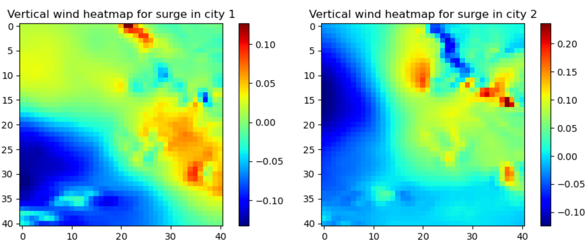

## Table of Contents

1. [Introduction](#introduction)  
2. [Data Analysis](#data-analysis)  
    1. [Heat Maps](#heat-maps)  
    2. [Autocorrelation of the Tidal Surplus Over Time](#autocorrelation-of-the-tidal-surplus-over-time)  
3. [Development of a Recurrent Neural Network (RNN)](#development-of-a-recurrent-neural-network-rnn)  
    1. [The Encoder-Decoder Model](#the-encoder-decoder-model)  
    2. [Splitting the Data into Training Set and Testing Set](#splitting-the-data-into-training-set-and-testing-set)  
    3. [Naive Implementation Without Using Pressure Fields](#naive-implementation-without-using-pressure-fields)  
    4. [Naive Implementation Using All Pressure and Wind Fields](#naive-implementation-using-all-pressure-and-wind-fields)  
    5. [Implementation with Dimensionality Reduction of Pressure and Wind Fields](#implementation-with-dimensionality-reduction-of-pressure-and-wind-fields)  
4. [Conclusion](#conclusion)

## Introduction

This project is part of the course Information and Complexity and aims to address the challenge 'Can you predict the tide?'. The challenge, proposed by the FLUMINANCE team at Inria, consists of predicting the tidal surplus based on past measurements and pressure fields. A direct application of this challenge is to provide more efficient responses to extreme tidal events. In this report, we detail our approach, which is carried out in two stages: we first present key elements of the data analysis, and then propose a relevant implementation of an _Encoder-Decoder_ model to meet this challenge.

## Data Analysis

### Heat Maps

To propose the most relevant algorithms to solve the given problem, we started by studying the dataset. A first approach consists of performing a linear regression of the tidal surplus at a given time based on each point of the pressure field at the same time. Prior to this, the values of the pressure field were z-scored. The correlation between the tidal surplus and the pressure field at a point provides us with the heatmap in Figure 1. Note that there are 5 times more pressure fields than time points of tidal surplus. Therefore, linear regression is done by taking the pressure field closest in time to the tidal surplus. Blue areas correspond to points where a depression induces a positive tidal surplus, and conversely, red areas show the opposite. From this simple analysis, we can already suggest that City 1 is likely located in the Southeast quadrant of the map, while City 2 is likely in the Northwest quadrant.  

We can proceed similarly using the spatial derivatives of the pressure field, which we refer to as horizontal wind (derivative along the x-axis) and vertical wind (derivative along the y-axis). The results are shown in Figures 2 and 3. Overall, the horizontal wind appears to carry more information about the tidal surplus (the heat maps for the vertical wind contain many coefficients close to zero).

#### Figure 1: Heatmap of the correlation between the centered and reduced pressure field and the tidal surplus for City 1 (left) and City 2 (right).

#### Figure 2: Heatmap of the correlation between the centered and reduced horizontal wind and the tidal surplus for City 1 (left) and City 2 (right).

#### Figure 3: Heatmap of the correlation between the centered and reduced vertical wind and the tidal surplus for City 1 (left) and City 2 (right).

### Autocorrelation of the Tidal Surplus Over Time

We have briefly discussed the information that the pressure fields provide regarding the tidal surplus in Cities 1 and 2. In this section, we analyze the information that the time series of the tidal surplus carries about itself. One way to do this is by looking at the autocorrelation of the tidal surplus over time for Cities 1 and 2. After reordering the tidal surplus data in chronological order, we plotted the autocorrelation curves shown in Figure 4. One limitation of this approach is that the time intervals between consecutive points are irregular. On average, the interval is 9 hours, but about two-thirds of the points are evaluated at the same time as the previous point, likely due to an expansion of the dataset. Nonetheless, it is still possible to observe that the tidal surplus is quite autocorrelated over time, with a more marked correlation for City 2 than for City 1. Therefore, it will likely be much easier to infer accurate results for City 2 than for City 1, which is indeed what we observe when separating the prediction scores for each city.

#### Figure 4: Autocorrelation of the tidal surplus for City 1 (left) and City 2 (right).

## Development of a Recurrent Neural Network (RNN)

The development of artificial neural networks for solving prediction problems in meteorology and climatology is relatively recent. Here, we draw inspiration from two articles that use an _Encoder-Decoder_ architecture [1][2][3], which have demonstrated state-of-the-art performance for time series prediction.

### The Encoder-Decoder Model

The architecture of the _Encoder-Decoder_ model that we implemented is shown in Figure 5. It consists of a sequence of recurrent cells (GRU cells) that take as input a vector from a time series and pass a "hidden vector" encoding the system state. Once the entire input sequence has been given to the encoder, the final "hidden vector" is passed to a decoder made of recurrent cells (decoder cells), which take the tidal surplus at time \(t\) as input and predict the tidal surplus at time \(t+1\). The implementation is done in Python using the Pytorch library.

Regarding recurrent cells, several choices can be made. The basic cell consists of a simple matrix multiplication followed by the application of a non-linear function. This approach presents issues with learning (gradient explosion or vanishing gradients ). To address this, LSTM cells were developed. GRU cells are an alternative, offering fewer parameters while providing identical performance.

The gradient descent is performed using the Adam method  with L2 regularization.

#### Figure 5: Architecture of the implemented Encoder-Decoder model.

### Splitting the Data into Training Set and Testing Set

We started by dividing the dataset into a training set (90%) and a testing set (10%) randomly. However, large discrepancies were observed between the testing set score we created and that of the challenge. This was due to the fact that the dataset contains several points that are actually very close or sometimes overlapping in time, causing overfitting on the training set to affect the testing set. To remedy this, we split the dataset into blocks of consecutive time points that are thus correlated over time (refer to Figure 4).

### Naive Implementation Without Using Pressure Fields

A first attempt was made by using the neural network as presented in Figure 5, but only taking the time series of tidal surplus as input and ignoring the pressure and wind fields. To minimize the score, we fine-tuned the network's parameters, such as the number of layers within each cell, the size of the hidden vector, and the dropout rate (randomly ignoring a certain percentage of parameters during training). We found that with two layers, a hidden vector of size 25, and a dropout rate of 20%, we achieved a minimum score of 0.63. The evolution of the test score during training is shown in Figure 6.

#### Figure 6: Scores for the training set and test set over the epochs of learning in the naive implementation without using pressure fields.

### Naive Implementation Using All Pressure and Wind Fields

A second approach involved constructing a large vector comprising the tidal surplus in each city, along with the pressure and wind fields at the closest time (see Figure 7). The results obtained in this case are shown in Figure 8, using four layers, a hidden vector of size 200, and a dropout rate of 50%. This network achieved a minimum score of 0.57, which is a 5% improvement over the previous method but at the cost of a 25,000-fold increase in the number of parameters. A significant limitation of this implementation is the tendency for the model to overfit, despite L2 regularization, which forced us to use a very high dropout rate.

#### Figure 7: Architecture with expanded input vectors including pressure and wind fields.

#### Figure 8: Scores for the training set and test set over the epochs of learning when using all pressure and wind fields.

### Implementation with Dimensionality Reduction of Pressure and Wind Fields

Finally, we propose a less naive implementation of the neural network that leverages our data analysis. Instead of feeding the entire pressure and wind fields into the model, we compute a dot product between these fields and their associated heat maps. A field of size \(41 x 41=1681\) is reduced to a vector of size 2 (one dimension per city). The input vector's size is thus reduced from 5045 to 8. With four layers for the recurrent cells and a hidden vector of size 25, we achieved a score of 0.5 (Figure 9, right), representing an 8% improvement over the naive method that included raw pressure and wind fields. This proposed method is more efficient and resource-conservative, requiring 5000 times fewer parameters.

#### Figure 9: Scores for the training set and test set over the epochs of learning with dimensionality reduction of pressure and wind fields.

Note that we are only using one-fifth of the available pressure fields. An extension to consider would be to not only use the pressure field closest in time to the tidal surplus measurement but also include the 4 previous fields, which could provide additional information. In this case, it would be necessary to compute heatmaps showing the correlation between the tidal surplus at time \(t\) and these fields at times \(t-1\), \(t-2\), \(t-3\), and \(t-4\).

## Conclusion

Based on a thorough data analysis, we proposed an _Encoder-Decoder_ model to tackle this challenge. In the context of the _Encoder-Decoder_ model, the issue of compressing the information contained in the pressure field is central. Feeding the network with raw pressure fields leads to overfitting problems, which are difficult to resolve. The method we propose, which reduces entire fields to a single scalar, may be extreme but offers good explainability and yields very good results. The optimal approach likely lies somewhere between these two extremes, avoiding translation-invariant compression methods, as the location of depressions and winds is crucial for solving the problem.

---

### References

- Scher, S., & Messori, G. (2019). Weather prediction using deep learning.
- Phandoidaen, P. et al. (2020). Forecasting with recurrent neural networks.
- Pascanu, R., Mikolov, T., & Bengio, Y. (2013). Difficulty of training RNNs.
- Kingma, D.P., & Ba, J. (2017). Adam: A method for stochastic optimization.
