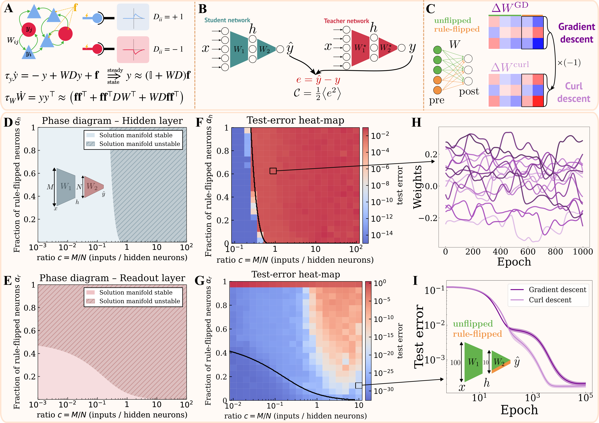

###### Motivation for non-gradient learning dynamics

Neural networks using unsupervised learning rules, such as Hebbian plasticity, can be shown to minimize objective functions like those for feature extraction, but only when paired with specific architectures [[Pehlevan et al. 2015, Neural Computation](https://ieeexplore.ieee.org/abstract/document/7226488)]. For instance, the learning dynamics of a recurrent neural network composed solely of excitatory neurons equipped with Hebbian plasticity can be derived as gradient descent on an objective function. However, not all learning dynamics follow a gradient: for example, introducing inhibitory neurons with plastic synapses governed by the same Hebbian rule will render the learning dynamics provably non-gradient (Fig. A). Mathematically, this occurs because the first-order recurrent terms in the neural activity, y=(I+WD)f (where f is an external input and D is a diagonal matrix with elements ±1 for neuron types), introduce non-symmetric terms into the weight update equations that cannot be derived from any scalar potential. This illustrates a more general principle: while certain architectures can be framed as performing gradient descent, many biologically plausible scenarios featuring diverse populations naturally give rise to learning dynamics that combine a gradient term with a non-gradient component. 

[full article available here.](https://doi.org/10.48550/arXiv.2510.02765)

###### Curl descent framework

 To investigate the impact of these non-gradient terms, we investigate feedforward networks in a teacher-student framework, a setting where the learning dynamics are analytically tractable [[Saxe et al. 2014](https://arxiv.org/abs/1312.6120)]. In this supervised setting, a student network learns to match a teacher’s output by minimizing its mean-squared error (Fig. B). Inspired by the emergence of non-gradient terms brought by the introduction of inhibitory neurons (Fig. A), we assign a subset of the student network’s neurons to a second population whose plasticity rules are sign-flipped. This modifies standard gradient descent updates for specific synapses originating from the rule-flipped neurons (Fig. C). This results in deterministic non-gradient learning dynamics we term ‘curl descent’ in analogy with the Helmholtz decomposition.

Under curl descent, the fixed points of the learning dynamics coincide with those of gradient descent. However, their stability may change depending on network architecture. We analyze this stability by examining the eigenvalues of the Jacobian matrix of the learning dynamics at solution points (C = 0, Fig. B). 

###### Results

Using random matrix theory, we characterize a dynamical phase transition [[Fruchart et al. 2021, Nature](https://www.nature.com/articles/s41586-021-03375-9)] where the solution manifold becomes unstable. We show that this transition is determined by two factors: the compression ratio of the network (#Input units/#Hidden units, Fig. D) and the fraction of rule-flipped synapses introduced either in the hidden or the readout layer.

Our analysis reveals that expansive networks (with more hidden units than inputs) are more robust to the introduction of these adversarial synapses than contractive ones (Fig. DE). Introducing rule-flipped synapses in the hidden layer leads to poor performance (Fig. F) and chaotic synaptic weight dynamics in the unstable regime (Fig. H). Surprisingly however, in the unstable regime caused by rule-flipped synapses in the readout layer, the learning dynamics still managed to find low-error regions (Fig. G), and could in some situations improve convergence speed. These results generalize to nonlinear networks (Fig. I) over a wide range of hyperparameters, including training set size, the student weights’ initialization, task complexity and fraction of rule-flipped synapses. 

###### Interpretation

Taken together, our theoretical and numerical results reveal that networks featuring non-gradient learning dynamics—arising from diverse synaptic populations—can still descend a global objective, depending on their architecture and the fraction of rule-flipped synapses. Compressive networks are more prone to destabilization of their solution points when rule-flipped ‘adversarial’ synapses are introduced, however this instability is not always detrimental. While adding non-gradient terms in the hidden weights can lead to catastrophic chaotic dynamics, introducing them in the readout weights enables the network to find alternative low-error solutions, and escape saddle points that typically trap gradient descent, leading to faster convergence.

Our results suggest that strict adherence to a global gradient may not always be the most efficient learning strategy. The diversity of plasticity rules observed experimentally might allow biological circuits to leverage non-gradient dynamics for more rapid and effective optimization. Our framework sets the foundation for investigating whether non-gradient learning dynamics can account for phenomena such as representational drift, where ongoing synaptic reorganization occurs without impairing performance, and ultimately provides theoretical insights into the conditions under which neural circuits learn in the real world.

Read the full story[ here.](https://doi.org/10.48550/arXiv.2510.02765)

**Caption.** **A** Excitatory-inhibitory recurrent neural network equipped with a Hebbian learning rule. yi: neural activity; Wij: synaptic weights; f: external input; Dii: diagonal matrix with elements ±1 for neuron types; : time constants. The recurrent neural dynamics (top equation) are evaluated at steady state up to first order. The learning dynamics (bottom equation) cannot be expressed as the gradient of a scalar function. **B** Teacher-student framework : both networks share the same architecture and receive inputs drawn from an i.i.d. normal distribution. The teacher’s weights are fixed while the student weights change through learning to minimize the mean-squared error C. **C** Schematic of the modified weight update. **D,E** Analytical phase diagrams. Stability of the solution manifold as a function of the compression ratio c and the fraction of rule-flipped synapses in each layer h(hidden) and r(readout). **F,G** Simulation results. Test-error as a function of c and h(hidden) and r(readout). The black curve shows the analytically derived stability boundary. **H** Example chaotic (top) and converging (bottom) weight dynamics in the unstable or stable regimes. **I** Test-error for gradient descent and curl descent with a single rule-flipped readout weight. Curl descent is faster for up to 50% rule-flipped synapses in this setting.